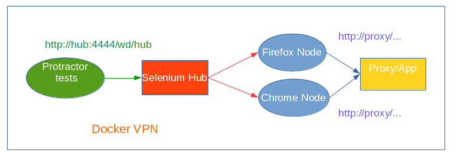

# Angularjs application testing with Protractor

[Protractor home page](https://angular.github.io/protractor/#/)

Protractor is an end-to-end test framework for AngularJS applications. Protractor runs tests against your application running in a real browser, interacting with it as a user would.

Protractor use `native events` and browser specific `drivers` to interact to a web application like a normal user would do.

Protractor provide support for Angular-specific elements, which help the testing of angularjs applications.

In order to launch end-to-end tests, Protractor use [Selenium](http://docs.seleniumhq.org/) that is a software for the automation of web browser.

## Understanding Selenium infrastructure

Selenium borns as Selenium RC (Remote Control), that is test tool that allows you to write automated web application UI tests in any programming language against any HTTP website using any mainstream JavaScript-enabled browser.

However, with the necessity of improving browser automation, the browsers started to provide their support to automation and Selenium Webdriver born.

From the Selenium site:

>The biggest change in Selenium recently has been the inclusion of the WebDriver API. Driving a browser natively as a user would either locally or on a remote machine using the Selenium Server it marks a leap forward in terms of browser automation.

>Selenium WebDriver fits in the same role as RC did, and has incorporated the original 1.x bindings. It refers to both the language bindings and the implementations of the individual browser controlling code. This is commonly referred to as just "WebDriver" or sometimes as Selenium 2.
Selenium 1.0 + WebDriver = Selenium 2.0

### Selenium grid

For my tests i used Selenium grid, that is a Selenium server that acts as a controller for browser, that can be attached as nodes. 

In order to control a browser from the server API, you need to connect browser nodes to the server (that is called `hub`).

When a test require using Selenium for browser automation, it sends a request to Selenium server, that find availables nodes and drive them to interact with the application. 

Nodes can be in different hosts and operating system.

### Docker containers

The infrastructure of our projects is always [Docker](https://en.wikipedia.org/wiki/Docker_%28software%29) container based.

In order to simply the test running process, we must setup containers for Selenium server, Selenium nodes, and Protractor.

Tools like [docker-compose](https://docs.docker.com/compose/) can be used to automate the process of building and starting all the needed containers.

For testing our application we need those container:

- application server or proxy server
- Selenium hub server
- Selenium node for Firefox
- Selenium node for Chrome
- Protractor

Selenium node containers are linked with the Selenium hub and webserver, while Protractor container is linked to Selenium hub. 

Protractor will send requests to Selenium server, that will drive the browser that will connect to the application server.

This is an example of `docker-compose.yml` configuration file for setting up the containers:

	
	...
	
	proxy:
    ...

	hub:
  	image: selenium/hub:latest
	
	firefox:
	  image: selenium/node-firefox:latest
	  links:
 	   - hub
 	   - proxy
	
	chrome:
  	image: selenium/node-chrome:latest
  	links:
   	 - hub
   	 - proxy
	
	e2e:
  	image: michelesr/protractor:latest
  	volumes:
    	- ./test/e2e:/code:ro
  	links:
    	- hub

Of course the missing part needs to be replaced with the configuration of the application containers, while `proxy` can be replaced with an application server if a proxy (like [nginx](https://en.wikipedia.org/wiki/Nginx)) is not used.

Once the container are linked together, entries in `/etc/hosts` will be added in their internal environment. If we want for example access to your proxy, we can use `http://proxy/` as `URL`.

For the e2e container we mount the directory `./test/e2e` to `/code` in order to expose our tests inside its.

The container images are pulled from [docker-hub](https://registry.hub.docker.com/).
