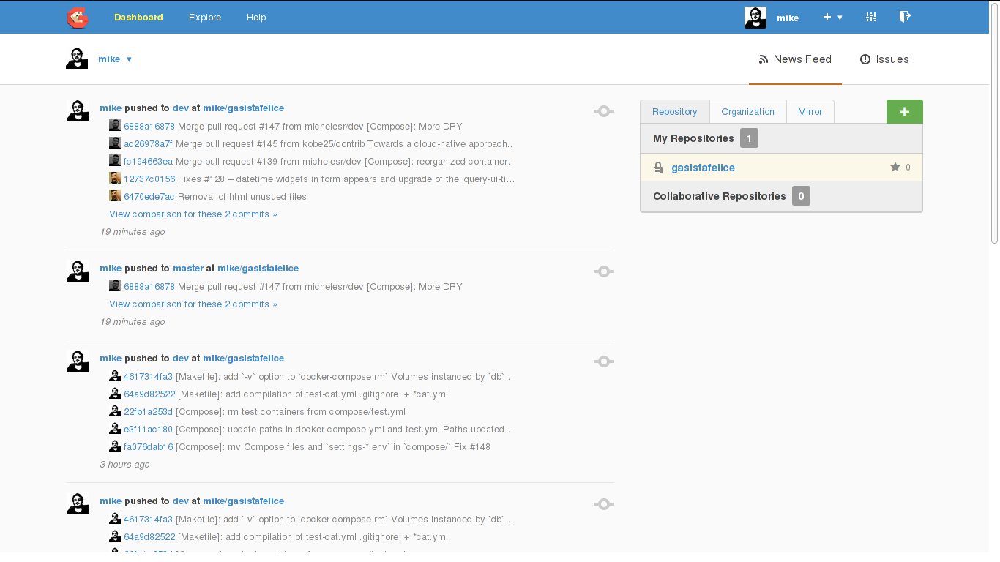
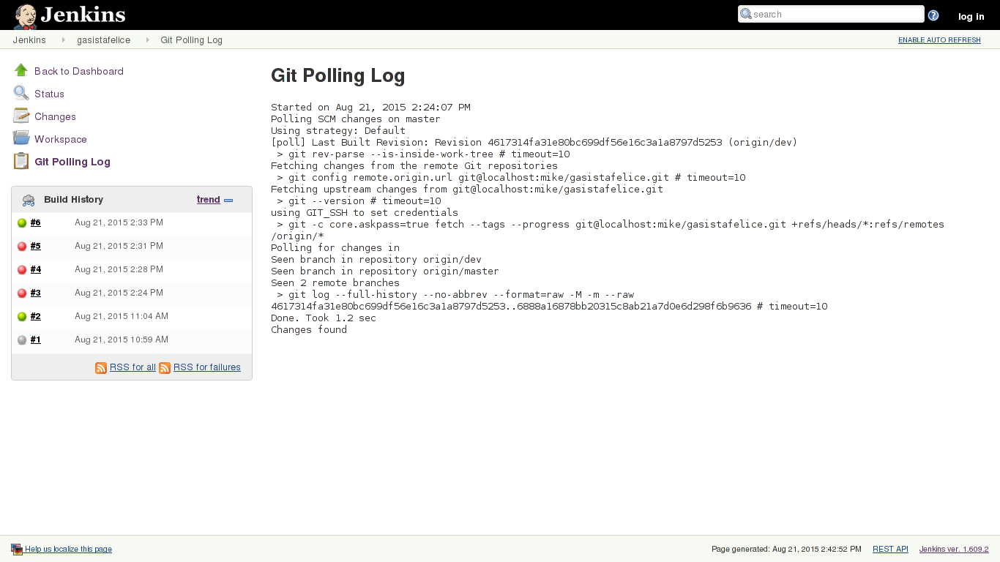

# Continuous Integration

## Overview

Continuous Integration is a software development practice where members of a
team integrate their work frequently: each person integrates at least
daily, leading to multiple integrations per day. Each integration is verified by
an automated build (including test) to detect integration errors as quickly as
possible @martinfowler-ci. This approach is the opposite of Deferred
Integration, where the work of the developers is integrated less frequently,
usually leading to integration problem. In Deferred Integration the integration
is treated as an event, while in Continuous Integration is a daily process.
Continuous integration is one of the twelve practices of *XP* (*Extreme
Programming*) @xp-ci, and is essential in order to adopt an Agile
software development process inside an organization.

In Continuous Integration, a developer is always aligned with the changes
introduced by other developers, and every change is tested by a Continuous
Integration system as soon as committed and pushed in the Source Code Management
system (SCM). Continuous integration helps to spot conflicts between the work of
two or more developers, allowing fast resolution, and therefore avoiding the
waste of a huge amount of time. Spotting the bugs as soon as possible helps their
localization and fix, while in Deferred Integration bugs are cumulative and hard
to manage.

The main benefits of Continuous Integration are the reduction of the integration
times and efforts (that involve economical costs), and the ability to always
release a new working version of the product (frequent small releases is also an
*XP* practice). Another benefit of Continuous Integration is the communication:
implementing an automated building and testing system will give visibility of
the current status of a project to all the person involved in his realization,
thus avoiding misunderstandings between those persons. Build results can also be
published and act as a quality indicator of the software development process and
released products. For Open Source projects, a Continuous Integration system
provides an incentive for contribution.

In order to provide an efficient Continuous Integration service, the CI system
has to satisfy the following requirements:

- the build process that follows a push from the developer has to be fast to
  provide the feedback as soon as possible

- a daily or weekly automated complete build of the projects has to be performed
  in order to assure the correctness of the software and the compatibility with
  its external dependencies

- the environment used for the build has to be similar to the environment
  used in production

The implementation will cover those aspect. The *build* term is used to indicate
the action of retrieving the application from SCM, building it and running the
automated tests.

### Forking Workflow for the Development

A common approach to team development inside an organization consists in setting
a main repository for the project, also referred as *upstream*: all the
developers that contribute to the project fork the main repository in their
account on the SCM server, clone the repository in their local machines, push
the changes on their personal fork on the server and then make a pull request on
the upstream for changes review and merge. If a forking workflow is adopted, is
necessary that all the forks that are pushed in SCM are also tracked by the
Continuous Integration system.

The Continuous Integration good practices involve the pulling of last changes,
their integration and the running of automated tests before every developer
commit, in order to discover the conflicts between the upstream and the local
work of the developer.

For `gasistafelice`, the main repository and developers forks are located on
Github server. The fork of the repository that acts as a use case in this
chapter is available at `https://github.com/michelesr/gasistafelice`. The `dev`
branch contains the latest change introduced by the developer, while the
`master` branch is aligned with the upstream.

### Organization

This chapter presents the organization and implementation of a Continuous
Integration system. This implementation is based on the cooperation
between different components:

- a Git based Source Code Management
- a Continuous Integration tool
- Docker and Docker Compose

For every component used in the implementation, the installation and
configuration procedure is explained. The procedure can be reproduced in
desktop environments as well as in servers. Before the description of the
procedure, the configuration of the Gasista Felice containers is presented.

## Gasista Felice containers configuration

Gasista Felice is configured, through `docker-compose.yml`, to pull the images
for the application components from Docker Hub, and to mount the source code of
the application from the local repository to allow changes to be reflected
inside the container. The component Dockerfiles are designed to always
perform a COPY instruction to copy the source code from the repository
during the build, that is performed by Docker Hub, but given that
`docker-compose.yml` contains mount instructions, the content copied at
build time is replaced with the content of the repository that resides in
the developer host (this is the normal behaviour in a Unix-like system where
during the mount the content of the directory specified as mount point is
replaced with the content of the mounted file system).

The mounting approach is perfect for development, where every change to the code
has to be applied immediately without the rebuild of the images, but in
production the code is copied when the images are built and changes imply
rebuilding. To provide a Continuous Integration testing environment closer to
the one used in production, a new `docker-compose.yml` is required:

    proxy:
      build: ./proxy
      ports:
        - '127.0.0.1:8080:8080'
        - '127.0.0.1:8443:8443'
      links:
        - front
        - back

    front:
      build: ./ui

    back:
      build: ./gasistafelice
      links:
        - db
      env_file: ./compose/settings_ci.env

    db:
      image: postgres:9.4
      env_file: ./compose/settings_ci.env

    hub:
      image: selenium/hub:latest

    e2e:
      build: ./test/e2e
      links:
        - hub

    firefox:
      image: selenium/node-firefox-debug:latest
      links:
        - hub
        - proxy
      env_file:
        - ./test/e2e/settings.env

    chrome:
      image: selenium/node-chrome-debug:latest
      links:
        - hub
        - proxy
      env_file:
        - ./test/e2e/settings.env

In this `docker-compose.yml` the `image` declarations are replaced with `build`,
and path for the Dockerfile with the build instructions are provided for every
application component image. To avoid conflicts with the original Docker Compose
file, this new configuration file is called `compose/ci.yml`. The ports
used for debugging purposes are removed.

The `settings.env` has been replaced with `settings_ci.env` in some components
to override the environment variables used in development with the production
variables. The discussed changes has been applied to the Gasista Felice
repository.

### Docker caching system

In order to reduce build times, providing a faster feedback to the developer,
the Docker caching system is exploited. When Docker builds an image from a
Dockerfile, if it founds an image layer already produced for that instruction,
it avoids the recreation of that layer. The cache is invalidated when the
Dockerfile changes, or for the COPY instructions, when the content inside the
directory to copy changes.

If the content of the directory to copy inside the container change, then the
cache for the COPY instruction will be invalidated, and the instruction will be
executed again, leading to a different output layer. If the layer produced by
the COPY instruction is different, than the cache is invalidated for all the
following instruction in the Dockerfile.

To avoid the rebuilding of the entire image, including software dependencies
that are downloaded through package managers, the COPY instructions for copying
the source code of the component inside the container have to be placed at the
bottom of the Dockerfile, encouraging Docker to not rebuild all the layer
related to the dependencies.

## Gogs - Go Git Service

*Gogs* (Go Git Service) is an open source lightweight Git Service that plays the
role of *SCM* (Source Code Management) in the Continuous Integration
implementation. Like Docker, Gogs is written in the Go programming language,
that is a compiled language. Go programs can be compiled in different operating
systems (including Linux, Mac OS and Windows) and the result of the compilation
is always a single binary, due to its static linking policy for libraries. Thus,
Gogs can be run as a standalone binary or inside a Docker container, that is the
choice made for this implementation.

### Installation

In order to install Gogs, a prebuilt image from Docker Hub is used:

    $ docker pull gogs/gogs
    $ docker run --name gogs -d \
          -p 3000:3000 \
          -p 5000:8080 \
          -p 32:22 \
          -v $HOME/gogs_data:/data \
          gogs/gogs

The ports `3000`, `8080` and `22` are exposed respectively to `3000` and `5000`
and `32`of the host. The port `3000` (http) is reserved for the Gogs service,
while the `8080` (http) is used for the Continuous Integration system, that will
be linked with Gogs later, and `22` is for ssh, that is used to establish
secure connections to git repositories. Gogs require a directory for
configuration files and data storage, so `$HOME/gogs_data` has been mounted
inside the container as `/data`.

### Configuration

The opening of the browser at `http://localhost:3000/` redirects to the first
configuration page. The configurations to adopt are showed in 6.1 and 6.2 tables:

Option                Value
------------------    --------------------
Database type         `SQLite3`
Database path         `data/gogs.db`
Application Name      `Gogs: Go Git Service`
Repository Root Path  `/home/git/repositories`
Run User              `git`
Domain                `localhost`
SSH Port              `22`
HTTP Port             `3000`
Application URL       `http://localhost:3000/`
------------------    ------------------------

Table: Gogs initial configuration

Option        Value
---------     ------------------------
Username      `SuperUser`
Password      `*********`
Email         `superuser@example.org`
---------     ------------------------

Table: Admin settings for Gogs

Settings are confirmed with `Install Gogs` button. Then a normal user account
has to be registered through the `Register` button.

Option        Value
---------     ------------------------
Username      `mike`
Email         `mikefender@cryptolab.net`
Password      `*********`
---------     ------------------------

Table: User registration in Gogs

### SSH Configuration

When the user connects to the repositories using http or https protocol, the
authentication is password based. Password can be lost or stolen, and an
asymmetric key based authentication is more secure. Also if http is used, the
connection isn't ciphered and sensible data can be sniffed from the network.

When the user register a public key for his account, the key can be used to
authenticate him on repository accesses through ssh protocol. In order to
generate a key pair, the user can run this command in his machine:

    $ ssh-keygen -C "ECDSA key for Gogs service" \
                 -f id_ecdsa_gogs -t ecdsa -b 256

    Generating public/private ecdsa key pair.
    Enter passphrase (empty for no passphrase):
    Enter same passphrase again:
    Your identification has been saved in id_ecdsa_gogs.
    Your public key has been saved in id_ecdsa_gogs.pub.
    The key fingerprint is:
    SHA256:/j+EDsnTpW2F+JXXeF5IwqYIa7pG/5j+bZFgSMBgUAg
    ECDSA key for Gogs service
    The key's randomart image is:
    +---[ECDSA 256]---+
    |E++o..     .     |
    |..  . o     + .  |
    |     . + . + + +.|
    |      + + o o * =|
    |     o oS+ B o +.|
    |    o  .= * =   .|
    |   . o  .+ +     |
    |    o .o oo .    |
    |   . .+oo.o...   |
    +----[SHA256]-----+

The command generates a 256 bit *ECDSA* (Elliptic Curve Digital Signature
Algorithm) key pair. The ECDSA provides smaller key size than RSA algorithm for
the equivalent level of security @cloudflare-ecdsa. An optional passphrase can
be added to lock and unlock the private key. The ssh client has to be configured
to use the right key and port to access Gogs, through the `~/.ssh/config` file:

    Host localhost
      User mike
      Port 32
      IdentityFile ~/.ssh/id_ecdsa_gogs
      IdentitiesOnly yes

The public key `id_ecdsa_gogs.pub` can be added to the Gogs server accessing to
the user account settings and selecting `SSH Keys -> Add Key`. The key content
has to be provided in the `Content` field, and an arbitrary name can be chosen,
then the operation is confirmed with `Add Key` button.

### Adding the Gasista Felice repository

After the registration and sign in, a repository for Gasista Felice named
`gasistafelice` has to be created. After the creation, the local repository can
be pushed on the Gogs server using git:

    $ cd path/to/gasistafelice/
    $ git remote add gogs git@localhost:mike/gasistafelice.git

    $ git push gogs master
    The authenticity of host '[localhost]:32 ([127.0.0.1]:32)'
    can't be established.
    ECDSA key fingerprint is
    SHA256:agpFsLWSqB4UJG/W0VQDu5pRVIT2pmp7h+94IMYReec.
    Are you sure you want to continue connecting (yes/no)? yes
    Warning: Permanently added '[localhost]:32' (ECDSA)
    to the list of known hosts.
    Counting objects: 22310, done.
    Delta compression using up to 4 threads.
    Compressing objects: 100% (8108/8108), done.
    Writing objects: 100% (22310/22310), 19.24 MiB | 18.89 MiB/s, done.
    Total 22310 (delta 14168), reused 21654 (delta 13629)
    To git@localhost:mike/gasistafelice.git
     * [new branch]      master -> master

The warning appears at the first connection to the server, then the public key
of the server is added to `~/.ssh/known_hosts` and the message doesn't present
again.

## Jenkins

*Jenkins* is a open source software for Continuous Integration written in Java.
It permits the scheduling of periodical or triggered builds and SCM pools for
Continuous Integration.

In order to build container based applications, Jenkins container require to
access a Docker daemon, and three different approaches are available for the
purpose:

- grant the access to the host Docker daemon inside the Jenkins container
- use https to communicate to the Docker daemon
- install Docker inside the Jenkins container

In term of security, the https based solution is the worst because exposes
Docker daemon on the network, while the other two solution are on the same
security level: sharing the Docker daemon on the host allows trusted Jenkins
users to exploit it in order to mount host volumes with write permission, while
installing and running Docker inside a container requires the creation of
privileged containers that can access all the host features including devices
and kernel specific functions. In every case, using a container for Jenkins is
always better than installing Jenkins in the host system because Docker provides
a layer of isolation from the system resources, and given that Jenkins is the
only process running inside the container, the only way to launch a malicious
script is from a Jenkins job. The creation of Jenkins jobs can be restricted to
trusted users from the security configuration.

The first solution, consisting in the sharing of Docker daemon inside the
Jenkins container has been adopted for the following reasons:

- it doesn't require the creation of privileged containers
- the same Docker daemon used to run Gogs and Jenkins is reused from Jenkins,
  avoiding overhead of running another Docker daemon
- using the same Docker daemon increases the chances to exploit cache
- the implementation is simple

### Installation

In order to install Jenkins and the support software, a custom Dockerfile is
required:

    FROM jenkins:latest

    MAINTAINER Michele Sorcinelli "mikefender@cryptolab.net"

    USER root
    RUN apt-get update \
          && apt-get install -y python python-pip sudo \
          && rm -rf /var/lib/apt/lists/*
    RUN pip install 'docker-compose==1.4'
    RUN echo "jenkins ALL=NOPASSWD: ALL" >> /etc/sudoers

    USER jenkins
    COPY plugins.txt /usr/share/jenkins/plugins.txt
    RUN /usr/local/bin/plugins.sh /usr/share/jenkins/plugins.txt

In this Dockerfile, starting from a Jenkins base image,  `python2`, `python-pip`
(Python Package Manager), `docker-compose` and `sudo` packages are installed,
then superuser privileges are granted to the Jenkins user in order to permit the
use of Docker. Generally the Docker daemon can be accessed without superuser
privileges if the user is added to the `docker` group, but given that Jenkins is
running inside a container, `sudo` is necessary. The `plugins.txt` file
containing the list of plugin to install copied inside the container is:

    scm-api:latest
    git-client:latest
    git:latest
    greenballs:latest

The command to properly run the Jenkins container, providing access to Docker
daemon and connection to the Gogs network is:

    $ docker pull michelesr/jenkins
    $ mkdir $HOME/jenkins_data
    $ docker run --name jenkins -d \
         -v /var/run/docker.sock:/var/run/docker.sock \
         -v /usr/lib/libdevmapper.so.1.02:/usr/lib/libdevmapper.so.1.02 \
         -v $(which docker):/usr/bin/docker \
         -v $HOME/jenkins_data:/var/jenkins_home \
         --net container:gogs \
         michelesr/jenkins

In order to grant access to the Docker daemon inside the container, the Unix
socket `/var/run/docker.sock`, the Docker client (retrieved with the bashism
`$(which docker)`), the `libdevmapper` library used for the creation of virtual
volumes, and a directory for Jenkins data have to be mounted. With the `--net
container:gogs` parameter, the Jenkins container will share the same network
stack of the Gogs container, and they will be able to communicate through the
loopback device `localhost`.

The command has been tested on an Arch Linux distribution and some parameters
(such as the library path) can be different in another distribution.  Also the
`jenkins_data` directory has to belong to the same UID of the Jenkins user
(`1000`). The UID of the current user can be retrieved with the command:

    $ cat /etc/passwd | grep $(whoami)
    michele:x:1000:1000::/home/michele:/usr/bin/zsh

If the UID doesn't match, it can always be forced with:

    # chown 1000:1000 $HOME/jenkins_data -R

Assuming that Gogs is running and has been launched with the command provided
previously, Jenkins can be accessed at the url `http://localhost:5000`, because
the port for the Jenkins service has been exposed at the launch of Gogs
container.

### Security Configuration

In order to avoid the execution of malicious scripts in Jenkins, the creation
and configuration of jobs has to be restricted to a small set of trusted users.
In the page `http://localhost:5000/configureSecurity/` the `Enable security`
checkbox has to be checked, and the options from Table 6.4 have to be setted:

Option                          Value
------------------------------  ---------------------------
TCP Port for JNLP slave agents  `Disable`
Security realm                  `Jenkins own user database`
Allow user to sign-up           `unchecked`
------------------------------  ---------------------------

Table: Security configuration for Jenkins

After confirming, an user has to be added accessing the page at the url:
`http://localhost:5000/securityRealm/addUser`, as showed in Table 6.5:

Option                          Value
------------------------------  ---------------------------
Username                        `mike`
Password                        `*********`
Full name                       `Michele Sorcinelli`
E-mail address                  `mikefender@cryptolab.net`
------------------------------  ---------------------------

Table: User registration in Jenkins

Then the access to unlogged user is disabled returning to the security
configuration page and setting:

- Authorization: `Logged-in users can do anything`

### Gasista Felice job configuration

Logging-in and navigating to the page `http://localhost:5000/newJob` a new job
for the Gasista Felice project can be setted choosing the `Freestyle Project`
option and `gasistafelice` as `Item name`. Configuration for the project
is showed in Table 6.6:

Option                          Value
------------------------------  ---------------------------------------
Source Code Management          `Git`
Build                           `Add build step -> Execute Shell`
Repository URL                  `git@localhost:mike/gasistafelice.git`
------------------------------  ---------------------------------------

Table: Configuration for Gasista Felice Jenkins job (1)

More remote repositories and branches for the same project can be tracked, for
example the upstream and developers forks can be tracked at the same time.
Jenkins use the git client to check the hash of the commits introduced on pushes
and avoid rebuilding of the same changes more times if found on different remote
repositories or branches, for example when commits are merged from a developer
fork to the upstream. Credentials for private repositories are required:

Option                          Value
------------------------------  ---------------------------------------
Credentials                     `Add -> SSH Username with private key`
Scope                           `Global`
Username                        `mike`
Private Key                     content of private key body
Passphrase                      passphrase chosen on key generation if exists
------------------------------  ---------------------------------------

Table: Credentials for Gasista Felice repository

Then `mike` can be used for `Credentials` field. Other options are:

Option                          Value
------------------------------  ---------------------------------------
Branches to build               `dev`, `master`
Build Triggers                  `Poll SCM`
Schedule
------------------------------  ---------------------------------------

Table: Configuration for Gasista Felice Jenkins job (2)

Then a shell script for the build has to be added from `Build -> Add a build
step -> Execute shell`:

    # override configuration
    mv compose/ci.yml docker-compose.yml

    # stop and rm old containers
    sudo docker-compose stop
    sudo docker-compose rm -f

    # build images
    sudo docker-compose build

    # start containers
    sudo docker-compose up -d

    # prepare the database
    sudo make dbtest

    # run e2e tests
    sudo docker-compose run --rm e2e

    # stop and rm running containers
    sudo docker-compose stop
    sudo docker-compose rm -f

The `compose/ci.yml` is renamed to `docker-compose.yml`, replacing the
configuration used for development with the one used in Continuous Integration
builds, that is more similar to the production environment configuration. Docker
Compose is used to build the container from the Dockerfiles, link and run them,
then the test database is loaded and the tests are launched. Before finishing
the build, the containers are stopped and removed. The reason for having `stop`
and `rm` both at the top and bottom of the script is that if the build fails for
some reason the containers are not stopped and removed. The build configuration
can be tested clicking on the `Build Now` button in the project dashboard.

### Remote repository hook configuration

In order to trigger the SCM poll from Jenkins when a push is performed, a hook
for the `gasistafelice` repository in Gogs has to be added:

    $ cd $HOME/gogs_data/git/repositories/mike/gasistafelice.git/hooks
    # touch post-recieve

The `post-recieve` hook script content is:

    #! /bin/sh
    curl http://localhost:8080/git/notifyCommit\
    ?url=git@localhost:mike/gasistafelice.git \
    2>/dev/null

Then the script ownership and execution permission have to be setted:

    # chown 999:999 post-receive
    # chmod +x post-receive

The configuration can be verified pushing to the remote `gasistafelice` repository:

    $ cd path/to/gasistafelice/
    $ git checkout origin/dev -b dev
    Branch dev set up to track remote branch dev from origin.
    Switched to a new branch 'dev'
    $ git push gogs dev
    Counting objects: 22, done.
    Delta compression using up to 4 threads.
    Compressing objects: 100% (22/22), done.
    Writing objects: 100% (22/22), 2.87 KiB | 0 bytes/s, done.
    Total 22 (delta 13), reused 0 (delta 0)
    remote: Scheduled polling of gasistafelice
    To git@localhost:mike/gasistafelice.git
     * [new branch]      dev -> dev

As can be seen from the command output, a poll of `gasistafelice` has been
scheduled by Jenkins and if changes are found on the `dev` or `master` branches,
the project will be built. The tracked branches can be setted in the project
configuration page. The status of all the project builds can be found at the
url: `http://localhost:5000/job/gasistafelice/`.

### Scheduling of periodic polls and builds

The scheduling of periodic polls for the gasistafelice project can be configured
from `http://localhost:5000/job/gasistafelice/configure` by filling the `Build
Triggers -> Poll SCM -> Schedule` field of the form.

The syntax used for the scheduling is similar to the one used for *CRON* jobs. A
nightly pool can be scheduled with this syntax:

    0 0 * * *

This will execute a SCM poll every night at midnight, but a better approach is
using the H tag:

    H H * * *

This syntax will assure the execution of the job once a day, but at a random
chosen time, avoiding the overlapping of more jobs.

Periodical builds can be set filling the form in `Build Triggers -> Build
Periodically` using the same syntax used for scheduling pools. For daily builds
Docker Compose can be instructed to avoid the using of the Docker cache,
ensuring that all the build is done from scratch, creating a new job with a
modified build script where the build script:

    ...

    # modified images build instruction
    sudo docker-compose build --no-cache

    ...

Then the new job can be scheduled for daily or weekly execution.

#### Parallel Jobs

Jenkins is configured by default to execute at most two jobs in parallel. Builds
for the same project are never executed in parallel and are instead queued. To
configure the maximum number of parallel builds, the system administrator can
navigate to the Jenkins system configuration page and set the number of executors.

### E-mail notifications

Jenkins can be configured to send e-mails with build reports. From the system
configuration page, a STMP server and an email adress can be configured (if the
`STMP server` field is left blank, `localhost` will be used).

A local STMP relay server can be installed and linked with Jenkins:

    $ docker pull panubo/postfix
    $ docker run --name postfix -d \
          -e MAILNAME='mail.example.org' \
          -e MYNETWORKS='127.0.0.1' \
          --net container:gogs \
          panubo/postfix

The recipient SMTP server can be configured with a anti-spam filter that can
block this kind of e-mail notifications, especially if the IP address is
domestic or dynamic:

     postfix/smtp[200]: B5F3581CEE: to=<jenkins@mail.example.org>,
     relay=mail.befair.it[80.85.85.154]:25, delay=0.58,
     delays=0.02/0/0.48/0.08, dsn=5.7.1,
     status=bounced (host mail.befair.it[80.85.85.154]
     said: 554 5.7.1 Service unavailable;
     Client host [82.51.4.196] blocked using zen.spamhaus.org;
     http://www.spamhaus.org/query/bl?ip=82.51.4.196
     (in reply to RCPT TO command))

To work around this problem, a different IP can be used or a remote SMTP server
can be configured. An e-mail notification for a project can be added from the
job configuration page:

- Add post-build action -> E-mail Notification
- Recipients: whitespace-separated list of recipient addresses

The available conditions are:

- Send e-mail for every unstable build
- Send separate e-mails to individuals who broke the build

### Continuous delivery

In order to provide Continuous Delivery Jenkins a new job can be added and
configured to act as a post build hook. This job will execute the trigger for
Continuous Delivery, that theoretically consists in accessing an API provided by
the production stack to deploy the update.

After this new job is configured, it can be triggered as a post-build action of
the job used to build and test the involved software. The post-build action can
be configured from the job configuration page:

- Add post-build action -> Build other projects
- Projects to Build -> The name of the post-build hook job

The available conditions are:

- Trigger only if build is stable
- Trigger only if the build is unstable
- Trigger even if the build fails
