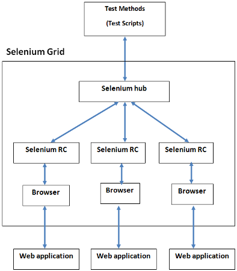

# AngularJS application testing with Protractor

Protractor is an end-to-end test framework for AngularJS applications.
Protractor runs tests against your application running in a real
browser, interacting with it as a user.

Protractor use native events and browser specific drivers to interact to
a web application like a normal user would do.

Protractor provide support for Angular-specific elements, which help the
testing of AngularJS applications.

In order to launch end-to-end tests, Protractor use Selenium that is a
software for the automation of web browser.

## Understanding Selenium architecture

Selenium borns as Selenium RC (Remote Control), that is a test tool that
allows to write automated web application UI tests in any programming
language against any HTTP website using any mainstream
JavaScript-enabled browser.

However, with the necessity to improve browser automation, the browsers
started to provide their native support to automation and Selenium
Webdriver born.

From the Selenium site:

> The biggest change in Selenium recently has been the inclusion of the
> WebDriver API. Driving a browser natively as a user would either
> locally or on a remote machine using the Selenium Server it marks a
> leap forward in terms of browser automation.
>
> Selenium WebDriver fits in the same role as RC did, and has
> incorporated the original 1.x bindings. It refers to both the language
> bindings and the implementations of the individual browser controlling
> code. This is commonly referred to as just "WebDriver" or sometimes as
> Selenium 2. Selenium 1.0 + WebDriver = Selenium 2.0

### Selenium grid

For the tests Selenium has been chosen.

Selenium grid consist of a server, called hub, that acts as a controller
for browsers, which can be attached as nodes.

When a test require Selenium for browser automation, it sends a request
to Selenium hub, that find availables nodes and drive them to interact
with the application.

Selenium hub will choose the right browsers according to the
requirements in the test specifications.

Nodes can be in different hosts and operating system, so the testing
capabilities are vast.

### Docker containers

The infrastructure of the projects discussed is always Docker container
based.

Tools like Docker Compose can be used to automate the process of
building and starting all the needed containers.

For testing the application those container are required:

-   Application containers
-   Selenium hub server
-   Selenium node for Firefox
-   Selenium node for Chrome
-   Protractor

Selenium node containers are linked with the Selenium hub and webserver,
while Protractor container is linked to Selenium hub.

Protractor will send requests to the Selenium server, that will drive
the browser to connect to the application or proxy server.

Considering that the applications discussed are always served with a
proxy server, such as nginx, the browser nodes will connect to the
proxy, that is the entrypoint.

This is an example of `docker-compose.yml` configuration file for
setting up the containers:

    ...

    proxy:
    ...

    hub:
      image: selenium/hub:latest

    firefox:
      image: selenium/node-firefox:latest
      links:
        - hub
        - proxy

    chrome:
      image: selenium/node-chrome:latest
      links:
        - hub
        - proxy

    e2e:
      image: michelesr/protractor:latest
      volumes:
        - ./test/e2e:/code:ro
      links:
        - hub

Of course the missing part needs to be replaced with the configuration
of the application containers, while `proxy` can be replaced with an
application server if a proxy is not used.

Once the container are linked together, entries in `/etc/hosts` will be
added in their internal environment. In order to access the proxy,
`http://proxy/` can be specified as URL.

For the Protractor container the directory `./test/e2e` needs to be
mounted to `/code` in order to make the test source code accessible from
the container.

The container images are pulled from Docker Hub.

#### Protractor image

Protractor image is not available yet as official docker image. For the
purpose of this and other applications, a protractor image has been
builded and pushed to the Docker Hub.

The image is called `michelesr/protractor`, and this is the Dockerfile
used for the build:

    FROM iojs:2.3

    MAINTAINER Michele Sorcinelli "mikefender@cryptolab.net"

    RUN npm install -g protractor

    RUN mkdir /code

    WORKDIR /code

    CMD ["protractor", "conf.js"] 

### Inspect the browser GUI

The solution above is sufficient to run browser tests, but a better
feedback can be obtained visually inspecting the behaviour of the
browsers.

In order to inspect the browser GUI this patch to `docker-compose.yml`
is required:

    firefox:
    -  image: selenium/node-firefox:latest
    +  image: selenium/node-firefox-debug:latest
       links:
         - hub
         - proxy
    +  ports:
    +    - '127.0.0.1:5900:5900'

The `selenium/node-firefox-debug` image provides a VNC server with
password *secret*, that will be exposed.

Using a VNC client a visual connection to the browser can be established
from `localhost:5900` using *secret* as password.

The same can be done for `selenium/node-chrome`, binding a different
port (`5901` for example) for the purpose. However, the port used inside
the container is always `5900`.
