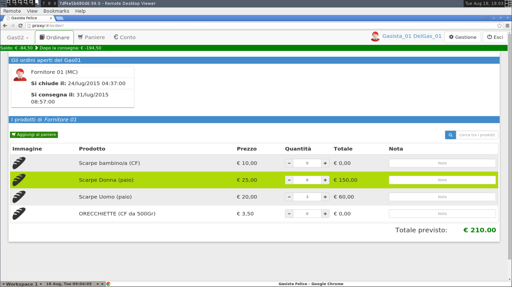

# Setup of the test environment

In the previous chapter the Protractor framework has been used in order to implement
browser automation based end-to-end tests for the AngularJS web interface of
Gasista Felice application. In this chapter the software used to run Protractor
based test is discussed and in particular its container based structure and
interaction with the web application. Assuming that the developer is already
using Docker and Docker Compose to run the container based application, the
container structure is extended in order to include the testing containers and
to permit the running of the end-to-end tests without the duty of manual
installation and configuration of the testing framework relapsing on the
developer.

## Protractor

Protractor is not available yet as official Docker image. For the purpose of
running end-to-end tests for Gasista Felice and other AngularJS web
Applications, a Protractor image has been builded and pushed to the Docker Hub.
The image is called `michelesr/protractor`, and this is the Dockerfile used for
the build:

    FROM iojs:2.4

    MAINTAINER Michele Sorcinelli "mikefender@cryptolab.net"

    RUN npm install -g protractor

    RUN mkdir /code

    WORKDIR /code

    CMD ["protractor", "conf.js"]

Protractor is a *Node.js* application. Node.js is a cross-platform runtime
environment for server-side and networking Javascript applications. In order to
run Protractor, a *Io.js* image as been used as base. Io.js is a fork of the
Node.js open-source project, created for the primary purpose of moving the
Node.js project to a structure where the contributors and community can step in
and effectively solve the problems facing Node (including the lack of active and
new contributors and the lack of releases) @node-to-iojs . From the `iojs:2.4`
base image, Protractor framework is installed using `nmp` (Node Package
Manager), a `/code/` directory is created and used as working directory, and the
`protractor conf.js` command is used as default command for running the
framework.

The `conf.js` configuration file is the entry point of Protractor:

    // conf.js
    exports.config = {
      seleniumAddress: 'http://hub:4444/wd/hub',
      specs: ['spec.js'],
      multiCapabilities: [
        { browserName: "firefox" },
        { browserName: "chrome" }
      ]
    }

The `exports.config` object is used to define the configuration of the
Protractor framework, that includes:

- a list of specification files used to run the end-to-end tests
- a list of the browsers used as clients for the web application
- the network address of the *Selenium* server

## Selenium

Selenium is an application framework for the execution of browser automation
scripts, and is written in the Java programming language.

The history of Selenium begin with *Selenium Remote Control*. Selenium RC is a
server that accept requests for browser automation through an http API. The http
API can be accessed with drivers available for different programming language,
such as Java, Python, PHP, Ruby, .NET, Perl and Javascript. With the diffusion
of Selenium and browser automation scripts, browsers start to provide
native support for the automation, leading to the born of *Selenium Web Driver*.

Selenium Web Driver is the successor of Selenium RC, and the main different is
in the interaction with web browsers, that is implemented with browser specific
drivers. While in Selenium RC a server for running tests is required, Selenium
Web Driver directly starts and controls the browsers. Client API for Selenium
Web Driver are available for different languages, so that the automation scripts
can be written in the developer preferred language. In order to run Web Driver
on remote machines a Selenium Grid server is required.  Selenium Grid consist of
different components:

- a Selenium server, called *hub*, that serves as controller for the browsers
- Web Driver nodes for the required browsers (Firefox and Chrome)

The Web Driver nodes attach to the Selenium hub in order to be controlled, then
the Protractor testing framework sends request to the hub in order to run
end-to-end tests in the desired browsers. The hub search the required browsers
from the available nodes and controls them in order to test the web application.

The nodes can be in different machines and operating system. In particular, in
our implementation the hub and the nodes runs inside Docker containers, and they
are linked through the Docker VPN. Like Selenium RC, the Selenium Grid hub is
accessible with the http protocol.

## Containers configuration

In order to link the testing containers to the application a new Docker Compose
configuration file is required:

    proxy:
      image: befair/gasistafelice-proxy:latest
      volumes:
        - ./proxy:/etc/nginx/conf.d:ro
      volumes_from:
        - back
      ports:
        - '127.0.0.1:8080:80'
        - '127.0.0.1:8443:443'
      links:
        - front
        - back

    front:
      image: befair/gasistafelice-front:latest
      volumes:
        - ./ui:/code/ui:rw

    back:
      image: befair/gasistafelice-back:latest
      volumes:
        - ./gasistafelice:/code/gasistafelice:ro
        - ./gasistafelice/fixtures:/code/gasistafelice/fixtures:rw
        - /tmp/gf_tracebacker:/tmp/tracebacker:rw
        - /tmp/gf_profiling:/tmp/profiling:rw
      ports:
        - '127.0.0.1:7000:7000'
      links:
        - db
      env_file: ./settings.env

    db:
      image: postgres:9.4
      env_file: ./settings.env

    hub:
      image: selenium/hub:latest

    firefox:
      image: selenium/node-firefox-debug:latest
      links:
        - hub
        - proxy
      ports:
        - '127.0.0.1:5900:5900'
      env_file:
        - ./test/e2e/settings.env

    chrome:
      image: selenium/node-chrome-debug:latest
      links:
        - hub
        - proxy
      ports:
        - '127.0.0.1:5901:5900'
      env_file:
        - ./test/e2e/settings.env

    e2e:
      image: michelesr/protractor:latest
      volumes:
        - ./test/e2e:/code:ro
      links:
        - hub

The default `docker-compose.yml` file has been extended with testing containers:

- `hub` is the container of Selenium Grid hub
- `firefox` is the container of the Selenium Grid node for Mozilla Firefox browser
- `chrome` is the container of the Selenium Grid node for Google Chrome browser
- `e2e` is the Protractor container

In particular, the `firefox` and `chrome` containers are linked to `hub` for
registering and to `proxy` in order to access the web application. The `e2e`
tests is linked with the `hub` in order to allow the forwarding of test
requests.

This new configuration file has been called `docker-compose-dev.yml` and is used
to run the tests from the Makefile:

    ...

    test-e2e:
        @echo 'End-to-end test: running protractor'
        @docker-compose -f docker-compose-test.yml up -d
        @sleep 5
        @docker-compose -f docker-compose-test.yml run --rm e2e

    ...

The `@` is used as command prefix to avoid their printing on the console. The
`sleep 5` is used to wait 5 seconds after containers start in order to made
their processes initiate correctly before sending requests to them.

The end-to-end tests can be launched from Gasista Felice repository root with:

    $ make up
    Starting gasistafelice_front_1...
    Starting gasistafelice_db_1...
    Starting gasistafelice_back_1...
    Starting gasistafelice_proxy_1...

    $ make dbtest
    ...
    ...

    $ make test-e2e
    End-to-end test: running protractor
    Creating gasistafelice_hub_1...
    gasistafelice_db_1 is up-to-date
    gasistafelice_back_1 is up-to-date
    Creating gasistafelice_e2e_1...
    gasistafelice_front_1 is up-to-date
    gasistafelice_proxy_1 is up-to-date
    Creating gasistafelice_chrome_1...
    Creating gasistafelice_firefox_1...
    [launcher] Running 2 instances of WebDriver
    .................
    ------------------------------------
    [chrome #2] PID: 16
    [chrome #2] Specs: /code/spec.js
    [chrome #2]
    [chrome #2] Using the selenium server at http://hub:4444/wd/hub
    [chrome #2] ............
    [chrome #2]
    [chrome #2] Finished in 24.756 seconds
    [chrome #2] 12 tests, 26 assertions, 0 failures
    [chrome #2]

    [launcher] 1 instance(s) of WebDriver still running
    ...
    ------------------------------------
    [firefox #1] PID: 11
    [firefox #1] Specs: /code/spec.js
    [firefox #1]
    [firefox #1] Using the selenium server at http://hub:4444/wd/hub
    [firefox #1] ............
    [firefox #1]
    [firefox #1] Finished in 31.339 seconds
    [firefox #1] 12 tests, 26 assertions, 0 failures
    [firefox #1]

    [launcher] 0 instance(s) of WebDriver still running
    [launcher] chrome #2 passed
    [launcher] firefox #1 passed

The images used for `hub`, `firefox` and `chrome` containers are provided by
Selenium developers and retrieved from Docker Hub. The `michelesr/protractor`
image is retrieved from Docker Hub and has been built using the Dockerfile
exposed previously.

### Inspect browser behaviour using VNC

The `selenium/node-firefox-debug` and `selenium/node-chrome-debug` are
distributed with a built-in VNC server that can be accessed in order to visually inspect
the browser behaviour during the running of end-to-end tests. For this purpose
the `docker-compose-dev.yml` expose ports `5900` of `firefox` and `chrome`
containers as `5900` and `5901`, so they can be accessed with a VNC client.

