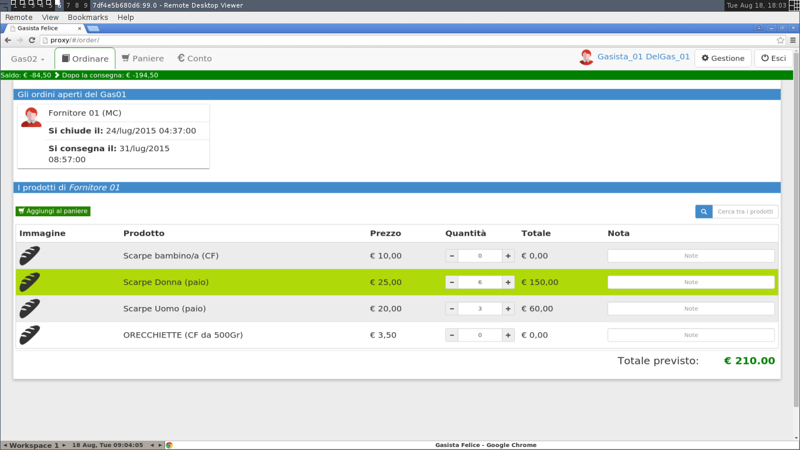

# Setup of the test environment

While in the previous chapter the Protractor framework has been used in order to
implement browser automation based end-to-end tests for the AngularJS web
interface of Gasista Felice application, in this chapter the software used to
run Protractor based end-to-end tests is discussed and in particular its
container based virtualization and interaction with the web application
containers.

Given that Docker and Docker Compose are already used to run the containerized
application, the container structure is extended in order to include the testing
containers and to permit the running of the end-to-end tests without the burden
of manual installation and configuration of the testing framework resting on
developers.

## Protractor

Protractor is not available yet as official Docker image. With the purpose of
running Protractor end-to-end tests for Gasista Felice and other AngularJS web
applications, a Protractor image has been builded and pushed to the Docker Hub.
The image is called `michelesr/protractor`, and this is the Dockerfile used for
the build:

    FROM iojs:3

    MAINTAINER Michele Sorcinelli "mikefender@cryptolab.net"

    RUN npm install -g protractor

    RUN mkdir /code

    WORKDIR /code

    CMD ["protractor", "conf.js"]

Protractor is a *Node.js* application. Node.js is a cross-platform runtime
environment for server-side and networking Javascript applications. In order to
run Protractor, an *Io.js* image has been used as base. Io.js is a fork of the
Node.js open-source software, created for the primary purpose of moving the
Node.js project to a structure where the contributors and community can step in
and effectively solve the problems facing Node (including the lack of active and
new contributors and the lack of releases) @node-to-iojs. From the `iojs:3`
base image, Protractor framework is installed using `nmp` (Node Package
Manager), the `/code/` directory is created and used as working directory, and
`protractor conf.js` is used as default command for running the framework.

The `conf.js` configuration file is the entry point of Protractor:

    // conf.js
    exports.config = {
      seleniumAddress: 'http://hub:4444/wd/hub',
      specs: ['spec.js'],
      multiCapabilities: [
        { browserName: "firefox" },
        { browserName: "chrome" }
      ]
    }

The `exports.config` object is used to define the configuration of the
Protractor framework, that includes:

- a list of the test routine specification files
- a list of the browsers used as clients for the web application
- the network address of the *Selenium* server

## Selenium

Selenium is an application framework for the execution of browser automation
scripts, and is written in the Java programming language.

The history of Selenium begin with *Selenium Remote Control*. Selenium RC is a
server that accept requests for browser automation through an HTTP API. The HTTP
API can be accessed with drivers available for different programming language,
such as Java, Python, PHP, Ruby, .NET, Perl and Javascript. With the diffusion
of Selenium and browser automation scripts, browsers start to provide their
native support to automation, leading to the creation of *Selenium Web Driver*.

Selenium Web Driver is the successor of Selenium RC, and the main difference
consists in its interaction with web browsers, implemented with browser specific
drivers. While in Selenium RC a server for running tests is required, Selenium
Web Driver directly starts and controls the browsers. Client API for Selenium
Web Driver are available for different languages, so that the automation scripts
can be written in the developer preferred language. In order to run Web Driver
on remote machines a Selenium Grid server is required. Selenium Grid is divided
in different components:

- a Selenium server, called *hub*, that serves as controller for the browsers
- one or more web driver nodes for the required browsers (Firefox and Chrome)

The Web Driver nodes attach to the Selenium hub in order to be controlled, then
the Protractor testing framework sends request to the hub in order to run
end-to-end tests in the desired browsers. The hub search the required browsers
from the available nodes and controls them in order to test the web application.

The nodes can be located in different machines and operating systems. In
particular, in this implementation the hub and the nodes runs inside Docker
containers, and they are linked through the Docker VPN. Like Selenium RC, the
Selenium Grid hub is accessible through the HTTP API.

## Containers configuration

The containers used for end-to-end testing purpose are:

- `hub`:  Selenium Grid hub
- `firefox`: Selenium Grid node for Mozilla Firefox browser
- `chrome`:  Selenium Grid node for Google Chrome browser
- `e2e`: Protractor framework

In order to define the testing containers and their interaction with the
application a new Docker Compose configuration file is provided:

    hub:
      image: selenium/hub:latest

    firefox:
      image: selenium/node-firefox-debug:latest
      links:
        - hub
        - proxy
      ports:
        - '127.0.0.1:5900:5900'
      env_file:
        - ./test/e2e/settings.env

    chrome:
      image: selenium/node-chrome-debug:latest
      links:
        - hub
        - proxy
      ports:
        - '127.0.0.1:5901:5900'
      env_file:
        - ./test/e2e/settings.env

    e2e:
      image: michelesr/protractor:latest
      volumes:
        - ./test/e2e:/code:ro
      links:
        - hub

In particular, the `firefox` and `chrome` containers are linked to `hub` for
registering and to `proxy` that acts as entry point of the web application. The
`e2e` tests is linked with the `hub` in order to allow the forwarding of test
requests. This new configuration file is named `compose/test.yml` and is
used to run the tests trough the Makefile:

    ...

    test-cat.yml: docker-compose.yml compose/test.yml
            @cat docker-compose.yml compose/test.yml > test-cat.yml

    ...

    test-e2e: test-cat.yml
            @echo 'End-to-end test: running protractor'
            @docker-compose -f test-cat.yml up -d
            @sleep 5
            @docker-compose -f test-cat.yml run --rm e2e

    ...

The `test-cat.yml` file is generated as concatenation of `docker-compose.yml`
and `compose/test.yml` and is used by the `test-e2e` role of the Makefile as
configuration file of Docker Compose. The `@` is used as command prefix to avoid
their printing on the console. The `sleep 5` is used to wait 5 seconds after
containers start in order to made their processes initiate correctly before
sending requests to them.

### Test Running

The end-to-end tests can be launched from Gasista Felice repository root with:

    $ make up
    Starting gasistafelice_front_1...
    Starting gasistafelice_db_1...
    Starting gasistafelice_back_1...
    Starting gasistafelice_proxy_1...

    $ make dbtest
    ...
    ...

    $ make test-e2e
    End-to-end test: running protractor
    Creating gasistafelice_hub_1...
    gasistafelice_db_1 is up-to-date
    gasistafelice_back_1 is up-to-date
    Creating gasistafelice_e2e_1...
    gasistafelice_front_1 is up-to-date
    gasistafelice_proxy_1 is up-to-date
    Creating gasistafelice_chrome_1...
    Creating gasistafelice_firefox_1...
    [launcher] Running 2 instances of WebDriver
    ............
    ------------------------------------
    [chrome #2] PID: 15
    [chrome #2] Specs: /code/spec.js
    [chrome #2]
    [chrome #2] Using the selenium server at http://hub:4444/wd/hub
    [chrome #2] ............
    [chrome #2]
    [chrome #2] Finished in 17.822 seconds
    [chrome #2] 12 tests, 28 assertions, 0 failures
    [chrome #2]

    [launcher] 1 instance(s) of WebDriver still running
    ........
    ------------------------------------
    [firefox #1] PID: 10
    [firefox #1] Specs: /code/spec.js
    [firefox #1]
    [firefox #1] Using the selenium server at http://hub:4444/wd/hub
    [firefox #1] ............
    [firefox #1]
    [firefox #1] Finished in 21.79 seconds
    [firefox #1] 12 tests, 28 assertions, 0 failures
    [firefox #1]

    [launcher] 0 instance(s) of WebDriver still running
    [launcher] chrome #2 passed
    [launcher] firefox #1 passed

The images used for `hub`, `firefox` and `chrome` containers, provided by
Selenium developers, are retrieved from Docker Hub. The `michelesr/protractor`
image, retrieved from Docker Hub, has been built using the Dockerfile exposed
previously.

### Inspect browsers behaviour through VNC

The `selenium/node-firefox-debug` and `selenium/node-chrome-debug` are
distributed with a built-in VNC server that can be accessed in order to visually
inspect the browser behaviour during the running of end-to-end tests. For this
purpose the `compose/test.yml` exposes ports `5900` of `firefox` and
`chrome` containers as `5900` and `5901`, so they can be accessed with a VNC
client. The environment configuration file `test/e2e/settings.env` can be used
to set the screen resolution used by the VNC servers:

    SCREEN_WIDTH=1920
    SCREEN_HEIGHT=1080

